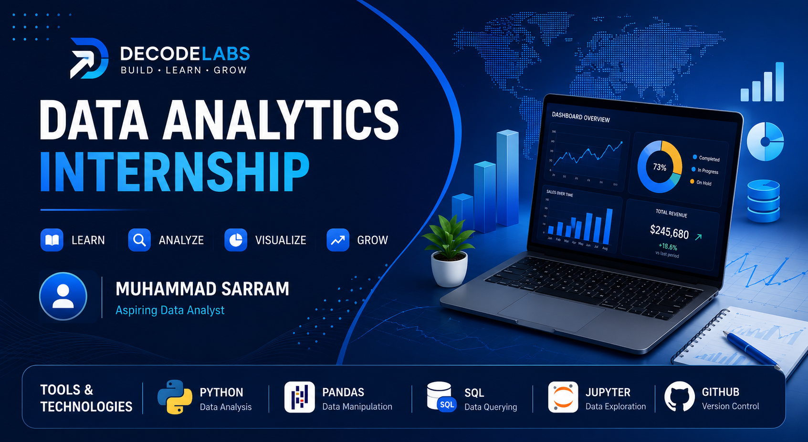

# 📊 Decode Labs Data Analytics Internship

<p align="center">
  
</p>

<p align="center">


</p>

---

# 🚀 Overview

Welcome to my **Decode Labs Data Analytics Internship Portfolio**.

This repository contains every project I completed during my internship at **Decode Labs**. Throughout the program, I worked on real-world e-commerce datasets, applying data cleaning, exploratory data analysis (EDA), and SQL to solve business problems and generate actionable insights.

The projects demonstrate my practical understanding of the complete data analytics workflow—from preparing raw data to communicating meaningful business findings.

---

# 📁 Internship Projects

| Week | Project | Description | Technologies |
|------|----------|-------------|--------------|
| ✅ Week 1 | Data Cleaning & Preparation | Cleaned and validated raw e-commerce data | Python, Pandas |
| ✅ Week 2 | Exploratory Data Analysis | Explored trends, statistics, and business insights | Python, Pandas, NumPy |
| ✅ Week 3 | SQL Business Analysis | Answered business questions using SQL | SQL |

---

# 🎯 Internship Objectives

During this internship I focused on developing practical skills in:

- Data Cleaning
- Data Preparation
- Exploratory Data Analysis (EDA)
- SQL Query Writing
- Business Analysis
- Data Interpretation
- Git & GitHub Documentation

---

# 🛠️ Technologies Used

<p align="center">


</p>

---

# 📚 Skills Demonstrated

- Data Cleaning
- Data Validation
- Missing Value Handling
- Duplicate Detection
- Data Type Conversion
- Exploratory Data Analysis (EDA)
- Descriptive Statistics
- SQL Querying
- Aggregate Functions
- Business Insight Generation
- Data Interpretation
- Git & GitHub

---

# 📂 Repository Structure

```text
DecodeLabs-Data-Analytics-Internship/
│
├── assets/
│   ├── banner.png
│   └── footer.png
│
├── Week-1-Data-Cleaning/
│
├── Week-2-Exploratory-Data-Analysis/
│
├── Week-3-SQL-EDA/
│
└── README.md
```

---

# 📌 Weekly Summary

| Week | Focus Area | Outcome |
|------|------------|---------|
| Week 1 | Data Cleaning | Cleaned, validated and prepared raw data |
| Week 2 | Exploratory Data Analysis | Discovered trends, patterns and business insights |
| Week 3 | SQL Analysis | Solved business questions using SQL queries |

---

# 📈 Portfolio Highlights

- ✅ Successfully completed **3 internship projects**
- 📊 Analyzed **1,200 e-commerce records**
- 👥 Worked with **1,189 unique customers**
- 🧹 Cleaned and validated real-world datasets
- 📈 Performed Exploratory Data Analysis
- 🗄️ Wrote SQL queries for business reporting
- 💡 Generated actionable business insights

---

# 🎓 Learning Outcomes

Throughout this internship, I strengthened my understanding of:

- Data Cleaning & Preparation
- Data Quality Assessment
- Exploratory Data Analysis (EDA)
- SQL for Data Analysis
- Business Reporting
- Analytical Thinking
- Problem Solving
- Project Documentation using GitHub

---

# 🏆 Internship Outcomes

This internship provided practical experience with:

- Python
- Pandas
- NumPy
- SQL
- Data Cleaning
- Exploratory Data Analysis
- Business Analytics
- GitHub Portfolio Development

---

# 📖 About This Repository

This repository serves as a complete record of my **Decode Labs Data Analytics Internship**.

Each project represents a different stage of the data analytics process and reflects the practical skills I developed while working with real-world datasets.

---

# 👨‍💻 About Me

Hi, I'm **Muhammad Sarram**.

I'm a Data Analytics student passionate about transforming raw data into meaningful business insights. My interests include data cleaning, exploratory data analysis, SQL, business intelligence, and dashboard reporting using real-world datasets.

I enjoy building portfolio projects that solve business problems through data.

---

# 📫 Connect With Me

- 🌐 Portfolio: https://sarram-ali.github.io/
- 💻 GitHub: https://github.com/sarram-ali
- 💼 LinkedIn: https://www.linkedin.com/in/sarram-ali/

---

## ⭐ If you found this repository helpful, consider giving it a star!

---

<p align="center">

### Thank you for visiting my internship portfolio!

**Muhammad Sarram**

*Aspiring Data Analyst*

Python • Pandas • SQL • Data Analytics

</p>